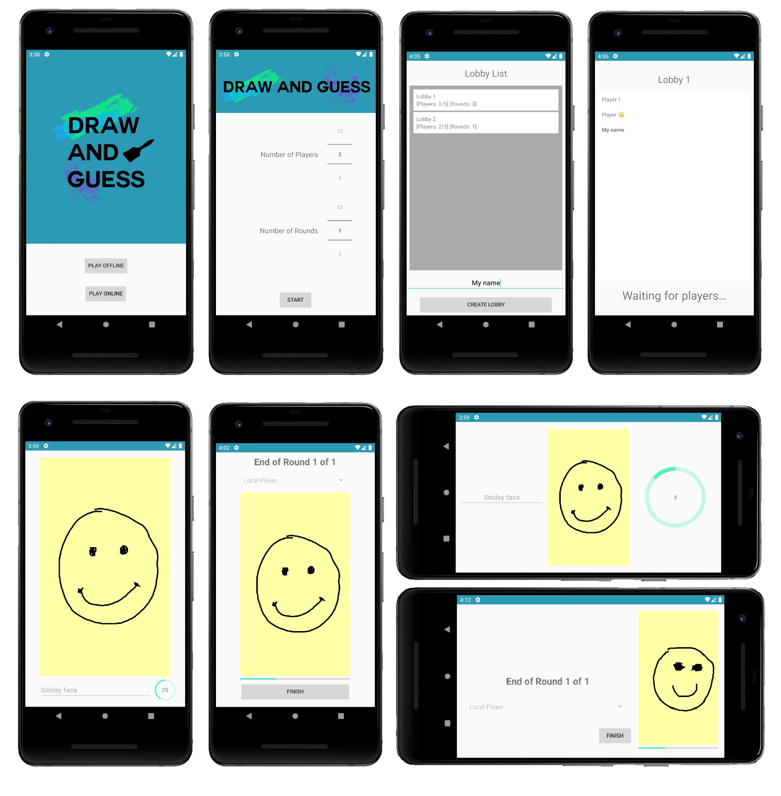

# Draw And Guess

## Overview
Draw And Guess is a casual and creative drawing game for 3-10 people! The game is built for Android and supports local and online multiplayer.

In local mode, the phone device acts as a drawing/guessing board and the players take turns using it. A random word is chosen and the first player draws it without using characters or numbers. The next player guesses the word behind the drawing. Then another one draws it again! The cycle continues until the end of the round, as in, after everyone plays and the device goes back to the first player.

The online mode functions in the same way, the difference being that every player has a board and plays simultaneously. Each player only draws/guesses once in each board.

At the end of each round all the results are displayed to the players allowing everyone to see the creations and interpretations.

## Table of Contents
- [Functionalities](#functionalities)
- [Preview](#preview)
- [Requirements](#requirements)
  - [Wordnik API](#wordnik-api)
  - [Firestore](#firestore)
- [Credits](#credits)

## Functionalities
Draw And Guess exposes the following functionalities:
- Functional and intuitive Android Application of the draw and guess game
- Supports portrait and landscape orientation for all activities
- Provides two game modes
  - Local mode
  - Online mode
- Allows game configuration
  - Custom number of players
  - Custom number of rounds
- Gathers random words through the [Wordnik API](https://developer.wordnik.com/)
- Displays a canvas for the players to draw and guess
- Displays a result screen where all the iterations of the board are shown
- Supports online matchmaking through [Firestore](https://firebase.google.com/docs/firestore)
  - Lists all the available lobbies
  - Possibility to create and join lobbies
  - Lists the players in a lobby
  - Starts the game when the lobby is full
  - Cancels games when a player disconnects

## Preview

## Requirements
Before building and running the application, the following steps are necessary:

### Wordnik API
As stated in the [overview](#overview) section, every game starts with a random word. The gathering of a random word is done by the use of the [Wordnik API](https://developer.wordnik.com/). In order to make requests to the Wordnik HTTP API an API Key is necessary. This API Key can be requested [here](https://developer.wordnik.com/).

Upon receiving the API Key, it has to be placed in the [secret.properties](app/secret.properties) file as the value of `wordnikApiKey`.

After setting the API Key in its respective place, the application will take care of reading the file and the API Key provided.

### Firestore
In order for online matchmaking to function, there needs to be the configuration of a Firestore project in the context of an Android application.

To achieve this, follow the next steps:
1. Create a Firebase project [here](https://console.firebase.google.com/)
2. In the center of the project overview page, click the **Android** icon or **Add app** to launch the setup workflow
3. Enter your app's package name in the Android package name field (If unchanged, the package name is `edu.isel.pdm.li51xd.g08.drag`)
4. Click **Register app**
5. Click **Download google-services.json** to obtain your Firebase Android config file (`google-services.json`)
6. Move the config file (`google-services.json`) into the module (app-level) directory of the app ([here](app/app))
7. Create a Firestore database for the project, making sure there is permission to read/write data

A more detailed guide is available [here](https://firebase.google.com/docs/android/setup).

## Credits
This application was developed for the Mobile Device Programming class (5th semester) at [ISEL](https://www.isel.pt/).

Developed by:
* [TiagoMMDavid](https://github.com/TiagoMMDavid)
* [PTKickass](https://github.com/PTKickass)
* [dvsshadow](https://github.com/dvsshadow)
